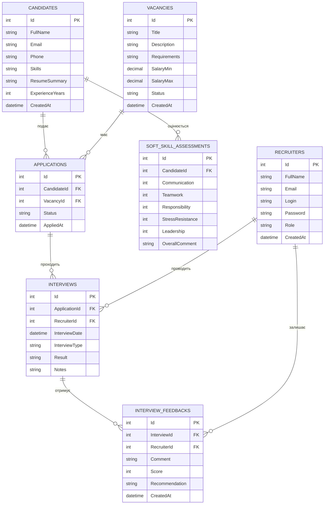
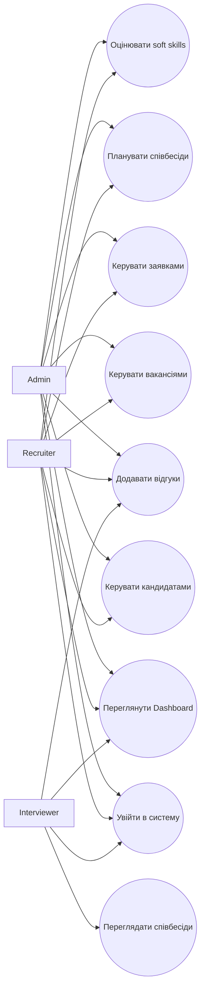
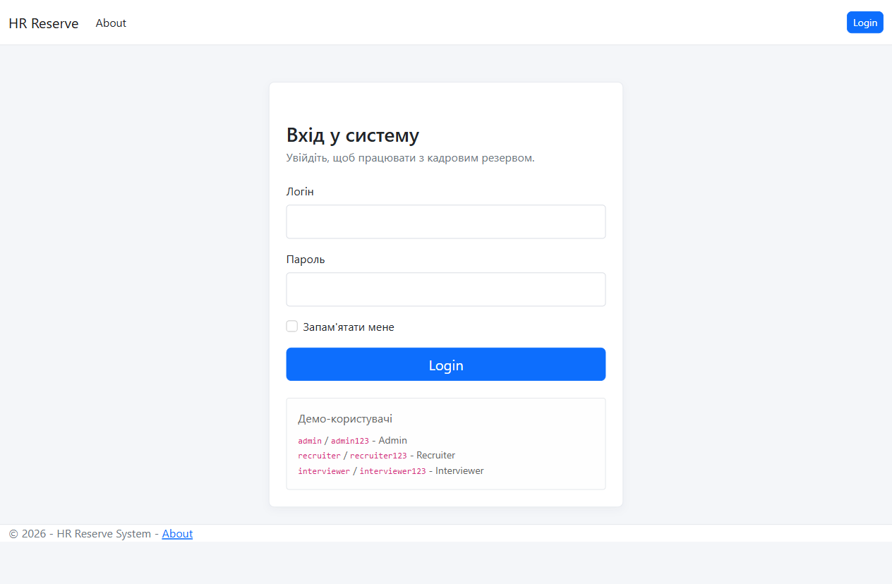
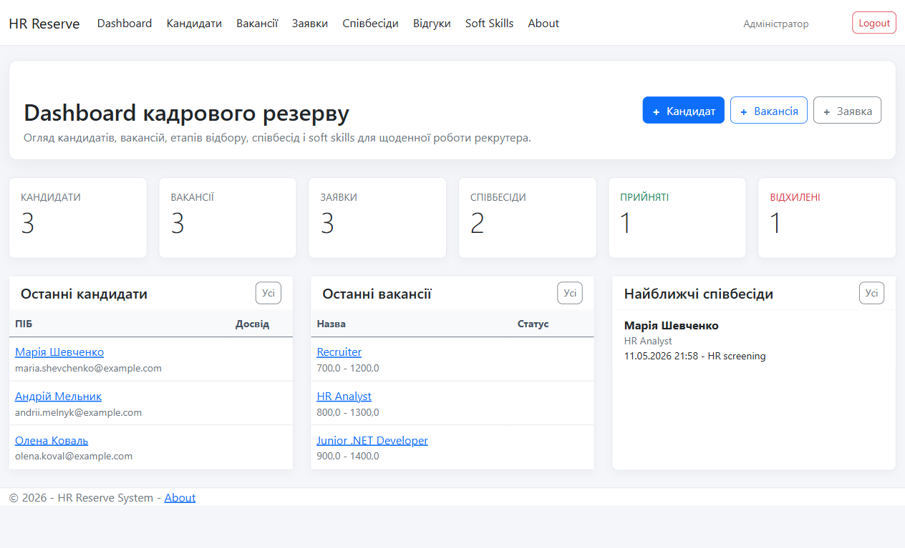
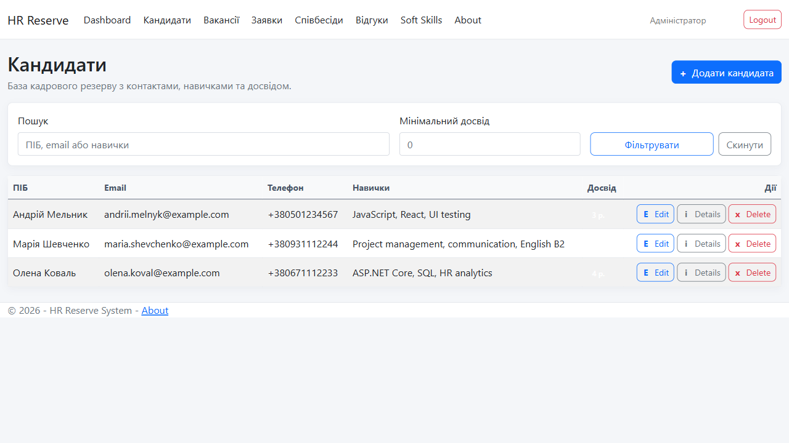
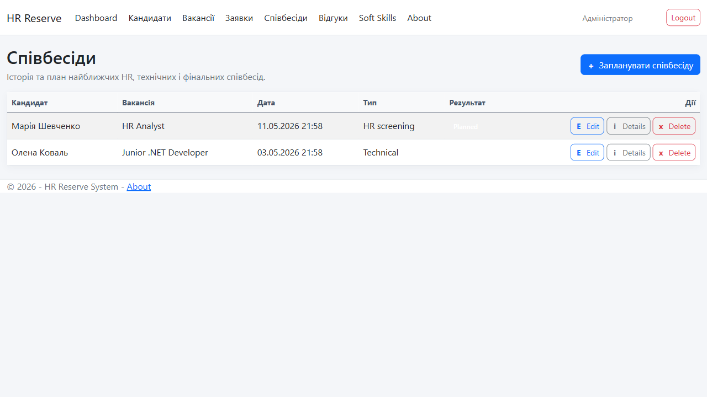
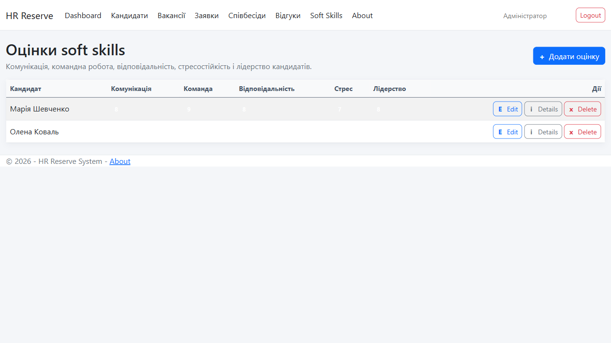

# Матеріали для курсової роботи HRReserveSystem

## Тема

Система управління кадровим резервом.

## Мета системи

Створити веб-застосунок для рекрутерів, який дозволяє вести базу кандидатів, вакансій, заявок, співбесід, відгуків та оцінок soft skills.

## ER-діаграма бази даних

## Use Case діаграма

## Архітектура MVC

Проєкт побудований за архітектурним шаблоном MVC:

- Model: класи `Candidate`, `Vacancy`, `Application`, `Interview`, `InterviewFeedback`, `SoftSkillAssessment` описують структуру даних і правила валідації.
- View: Razor Views відображають Dashboard, Login, About і CRUD-сторінки.
- Controller: контролери приймають HTTP-запити, працюють з EF Core через `ApplicationDbContext` і повертають відповідні Views.
- Data layer: `ApplicationDbContext` відповідає за доступ до SQLite, а `SeedData` створює демонстраційні дані.
- Authentication layer: `AccountController` і `DemoUserService` реалізують cookie authentication без ASP.NET Identity.

## Опис таблиць БД

| Таблиця | Призначення |
| --- | --- |
| `Candidates` | Зберігає кандидатів кадрового резерву, їхні контакти, навички та досвід. |
| `Vacancies` | Зберігає вакансії, вимоги, зарплатний діапазон і статус вакансії. |
| `Applications` | Пов'язує кандидата з вакансією та показує етап відбору. |
| `Interviews` | Зберігає історію та план співбесід за заявками. |
| `InterviewFeedbacks` | Зберігає оцінки, коментарі та рекомендації після співбесід. |
| `SoftSkillAssessments` | Зберігає оцінку soft skills кандидата за ключовими критеріями. |
| `Recruiters` | Зберігає користувачів системи, їх логіни, ролі та зв'язки зі співбесідами й відгуками. |

## Ролі користувачів

| Роль | Доступ |
| --- | --- |
| Admin | Повний доступ до всіх сторінок і CRUD-операцій. |
| Recruiter | Кандидати, вакансії, заявки, співбесіди, відгуки та soft skills. |
| Interviewer | Перегляд співбесід і додавання відгуків. |

## Скріншоти роботи системи

Після запуску проєкту скріншоти зберігаються в папці `Docs/screenshots/`.

## Інструкція користувача

1. Запустити застосунок командою `dotnet run`.
2. Відкрити URL з консолі.
3. Увійти під одним з демо-користувачів:
   - `admin` / `admin123`
   - `recruiter` / `recruiter123`
   - `interviewer` / `interviewer123`
4. На Dashboard переглянути кількість кандидатів, вакансій, заявок, співбесід, прийнятих і відхилених кандидатів.
5. У розділі "Кандидати" додати або знайти кандидата за ПІБ, email, навичками чи досвідом.
6. У розділі "Вакансії" додати вакансію або відфільтрувати список за статусом.
7. У розділі "Заявки" відстежити етапи відбору кандидатів.
8. У розділі "Співбесіди" переглянути історію та найближчі співбесіди.
9. У розділі "Відгуки" додати оцінку і рекомендацію після співбесіди.
10. У розділі "Soft Skills" зафіксувати оцінку комунікації, командної роботи, відповідальності, стресостійкості та лідерства.

## Висновки

У результаті розроблено веб-застосунок, який відповідає темі кадрового резерву: система містить базу кандидатів, вакансії, заявки, історію співбесід, відгуки, оцінки soft skills і статуси відбору. Рекрутер отримує єдиний інтерфейс для ведення HR-процесу, а ролі користувачів обмежують доступ відповідно до обов'язків.
